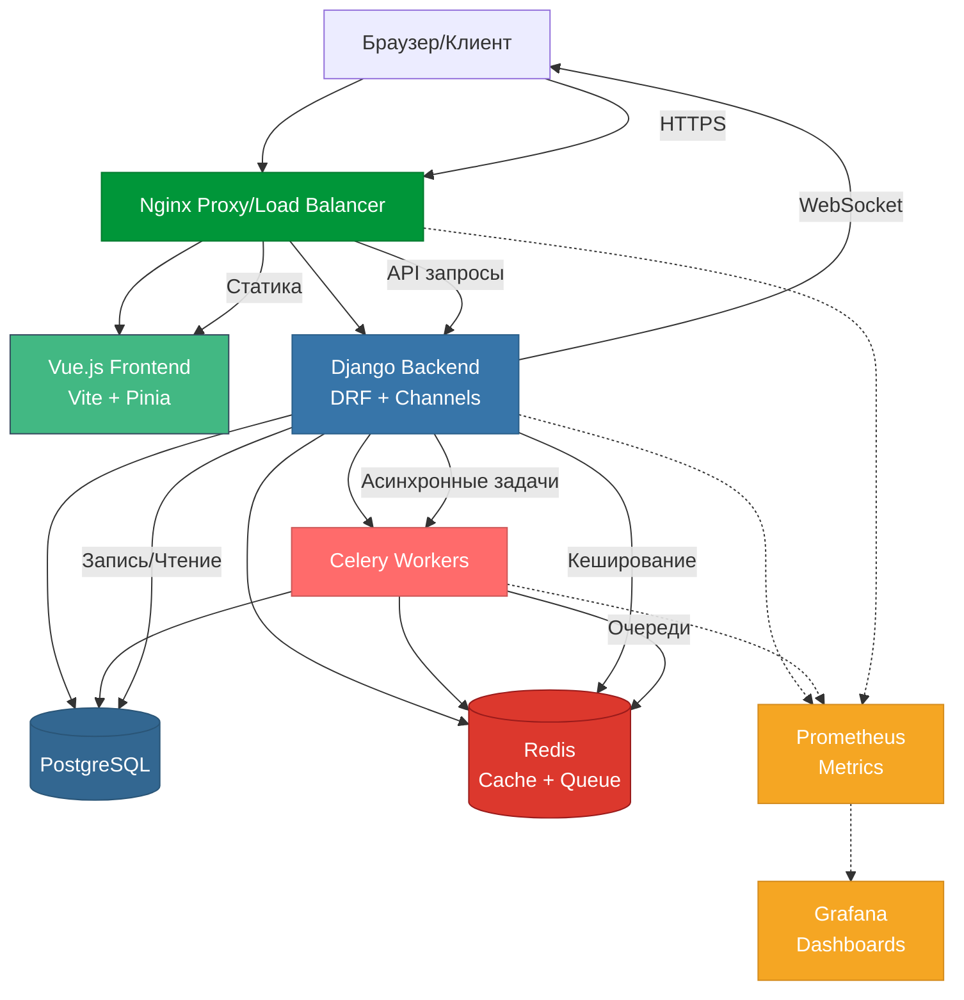

# Архитектура Food Delivery Service

## Описание компонентов

### Frontend (Vue.js)
- Single Page Application на Vue 3
- State Management с Pinia
- Сборка через Vite
- Компоненты UI с TailwindCSS

### Backend (Django)
- REST API через Django REST Framework
- WebSocket для real-time обновлений
- JWT аутентификация
- Асинхронные задачи

### Очереди и кеширование
- Celery для обработки асинхронных задач
- Redis как брокер сообщений
- Кеширование данных в Redis

### База данных
- PostgreSQL для хранения данных
- Миграции Django ORM
- Индексация для оптимизации запросов

### Прокси и балансировка
- Nginx как reverse proxy
- Балансировка нагрузки
- SSL/TLS терминация
- Раздача статики

### Мониторинг
- Prometheus для сбора метрик
- Grafana для визуализации
- Алертинг и оповещения

## Основные потоки данных

1. **Запросы клиентов**
   - HTTPS запросы через Nginx
   - WebSocket соединения для real-time обновлений
   - Статические файлы через Nginx

2. **Обработка заказов**
   - Создание через REST API
   - Асинхронная обработка в Celery
   - Уведомления через WebSocket

3. **Кеширование**
   - Кеширование частых запросов
   - Сессии в Redis
   - Очереди задач

4. **Мониторинг**
   - Сбор метрик со всех сервисов
   - Визуализация в Grafana
   - Система алертинга 