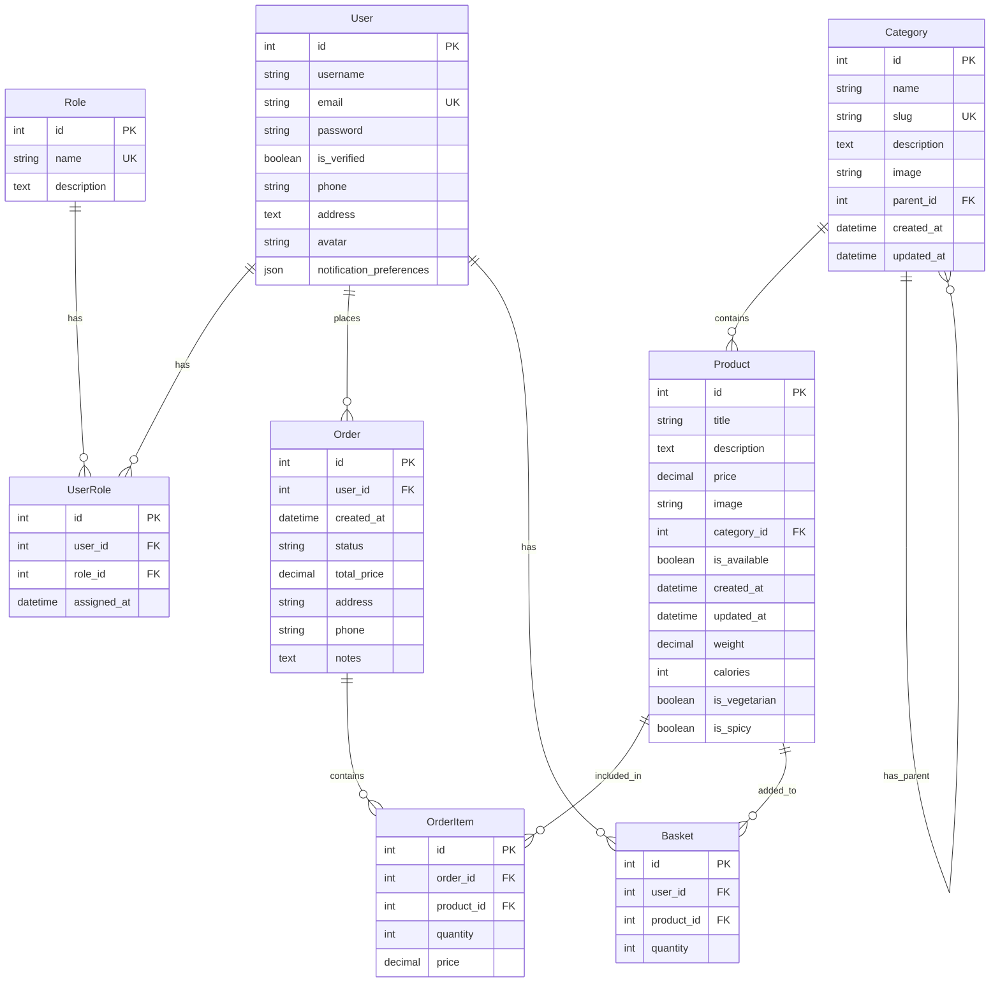

# ER-диаграмма Food Delivery Service

## Описание основных сущностей

### Пользователи и роли
- `User`: Расширенная модель пользователя с дополнительными полями для доставки
- `Role`: Роли пользователей в системе
- `UserRole`: Связующая таблица для реализации many-to-many связи

### Каталог товаров
- `Category`: Иерархическая структура категорий с возможностью вложенности
- `Product`: Детальная информация о продуктах с дополнительными атрибутами

### Заказы и корзина
- `Order`: Основная информация о заказе
- `OrderItem`: Позиции заказа с количеством и ценой
- `Basket`: Временное хранение выбранных товаров

## Основные связи

1. Пользователь может:
   - Иметь несколько ролей
   - Создавать множество заказов
   - Иметь одну корзину с несколькими товарами

2. Категории:
   - Могут иметь подкатегории (self-referential)
   - Содержат множество продуктов

3. Продукты:
   - Принадлежат к одной категории
   - Могут быть в нескольких заказах
   - Могут быть в нескольких корзинах

4. Заказы:
   - Принадлежат одному пользователю
   - Содержат несколько позиций (OrderItem) 